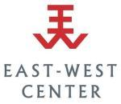

# Funding {#funding}

## Departmental Funding

Our primary form of funding for MA students is an **Achievement Scholarship** known as a tuition waiver. In order to be eligible for this, you need to be registered for a minimum of eight (8) credits in the Department of Linguistics.

Our primary form of funding for PhD students consists of a **Graduate Assistantship**. A student receiving a GAship needs to register for at least six (6) credits.

Courses counting toward the minimum registration requirement must be wthin the Department of Linguistics, though exceptions may be approved by the graduate chair in cases where courses outside the department are an integral part of the student's program.

Information about Graduate Assistantships and Achievement Scholarships can be found on the [department website](https://manoa.hawaii.edu/linguistics/funding/). Information about GA compensation can be found at the [Graduate Division](https://manoa.hawaii.edu/graduate/compensation-tax-withholding/).

Towards the end of each semester, the Graduate Chair will distribute a funding report form which all continuing students are required to complete and return by the stated deadline. This form asks for your funding request, eligibility for department tuition support, and other information relevant to assigning financial support for the next semester. Filling out this report is obligatory for all students, and especially important for those seeking (or expecting) financial support from the department. Meeting with your advisor is not required, but you can meet with the Graduate Chair if you need help to complete the form.

## Bilinski Fellowships

The [Bilinski Fellowship](https://manoa.hawaii.edu/linguistics/bilinski/)  provides two types of awards for PhD students:

-   The **Bilinski Dissertation Fellowship** provides \$25,000 per semester for up to three semesters to support ABD students during the dissertation writing phase of their studies.

-   The **Bilinski Pre-Dissertation Research Award** provides up to \$5000 to support data collection and fieldwork.

Applicants must meet US Citizenship/Residency requirements. More details on the Bilinski awards, and how to apply can be found [here](https://manoa.hawaii.edu/linguistics/bilinski/).

## Drechsel-Hubbard Endowed Fellowship

The [Drechsel-Hubbard Endowed Fellowship](https://manoa.hawaii.edu/linguistics/drechsel-hubbard-fellowship/) for Indigenous Language-Culture Research supports students working on their native or heritage Indigenous languages, especially those of the Pacific and North America. The award  provides $10,000 annually and can supplement a Graduate Assistantship.

## Thompson Fund for Research and Publication

The Laurence C. and M. Terry Thompson Fund for Research and Publication in Linguistics and Oral Literature supports field research and publication, with a special focus on languages of the US Pacific Northwest and Mainland Southeast Asian. More information will be forthcoming in early 2024.

## Conference Travel Awards

Occasionally the department makes funds available to support conference travel. All current Ph.D studends in good standing are eliguble for this award. Funds are made available retroactively, with applications due in January to fund travel over the previous calendar year. The Graduate Chair will announce the opening of the application at the end of Fall semester.

## GSO Grants and Awards

The [Graduate Student Organization](https://uhmgso.wixsite.com/website-1/grants-and-awards) (GSO) offers grants and awards to members to support conference travel, professional development and research expenses. Applicants may request up to \$1000 for domestic projects and \$2000 for international projects, and funding is in the form of reimbursement. Applications are reviewed monthly. For more information speak to your GSO representative prior to submitting application. 
## East-West Center

 The East-West Center is a federally funded institution co-located on the Mānoa campus, which promotes better relations and understanding among the people and nations of the United States, Asia, and the Pacific through cooperative study, research, and dialogue. Some MA students may qualify for an East-West Center [Graduate Degree Fellowship](https://www.eastwestcenter.org/education/ewc-graduate-degree-fellowship).

The graduate degree fellowship covers the cost of general tuition and fees for UHM graduate programs, books, housing in an East-West Center dormitory, and partial funding toward meals, health insurance, and incidental expenses. Funding for field study and conference presentations is offered on a competitive basis during the fellow's period of study.

The East-West Center Graduate Degree Fellowship invites applications from:

-   Citizens or permanent residents of the United States
-   Citizens of countries in the Pacific and Asia, including Russia

Priority in the student selection process is given to applicants with a demonstrated commitment to the Asia Pacific region.

## Extramural Funding

Occasionally faculty may bring in extra funding for GAships, above and beyond the department's normal GA allotment. These GAships could be full or half positions based on the needs of the position. Credit requirements for all GAships (i.e., department/extra funding and full/half positions) are the same as described above.

Students may also seek funding from outside sources to support dissertation research. Two common sources include NSF and ELDP.

### NSF Dissertation Awards

Linguistics Program - Doctoral Dissertation Research Improvement Grants ([Ling-DDRI](https://new.nsf.gov/funding/opportunities/linguistics-program-doctoral-dissertation-research))

> This award supports doctoral research on human language — encompassing investigations of the properties of individual human languages and natural language in general — and the intersections of linguistics with cognition, society and other areas of science.

Dynamic Language Infrastructure---Doctoral Dissertation Research Improvement Grants ([DLI-DDRI](https://new.nsf.gov/funding/opportunities/dynamic-language-infrastructure-doctoral))

> This award supports doctoral research that digitally records and documents languages---with an emphasis on endangered languages---through the preparation of lexicons, grammars, text samples and databases, advancing linguistic theory and the study of language. The maximum award amount is \$15,000 in direct costs.

Proposals deadlines are February 15 and September 15, annually. Students apply as co-PI, with their advisor as PI.

### ELDP Small Grants

The [Endangered Languages Documentation Project](http://eldp.net) (ELDP) provides a number of grants, including Small Grants of up to €10,000 to support field work.

> ELDP supports the creation of documentary corpora: collections of materials such as digital video and audio recordings, texts of various kinds. ELDP does not support purely theoretical work or work focused solely on revitalization/maintenance.

Students apply as the PI, but their advisor should serve as a referee.

## Outside Employment

Graduate Assistants are strongly discouraged from seeking outside employment during the term of their appointment. University funds for GAships are limited, and the expectation is that these funds be used to further degree completion. While outside employment may be compatible with these goals, it is important to consider the effects that any such outside employment may have on your ability to do your GAship effectively and to make good progress toward your degree.

As outlined in the policies below, permission is required prior to accepting outside employment, and failure to seek approval for outside employment could result in termination of the GAship. You are therefore encouraged to discuss potential outside employment with your advisor and the Graduate Chair, providing evidence that any potential outside employment will not interfere with your ability to complete your GAship duties and make continued progress toward your degree. 

Graduate Divsion [Rules and Regulations](https://manoa.hawaii.edu/graduate/rules-regulations/)

> All GA’s who wish to work more than 20 hours per week must complete and file the petition to work more than 20 hours with Graduate Division Student Services. GAs who are international students also need to obtain approval from the International Student Services. Unauthorized work beyond 20 hours per week may result in the loss of an assistantship. GA’s are advised to carefully consider the potential effects of additional work load on their ability to maintain satisfactory academic progress.

UH Executive Policy [5.223](https://www.hawaii.edu/policy/?action=viewPolicy&policySection=ep&policyChapter=5&policyNumber=223), section III.H.

> Outside employment. The University’s priority for a graduate assistant is degree completion. While outside employment in addition to the graduate assistantship is not prohibited, such outside employment is discouraged to allow the graduate student to focus on degree completion. However, the University recognizes the need for graduate assistants to fulfill personal financial obligations. The graduate student shall consider the impact of such outside employment on degree completion and the fulfillment and performance of the graduate assistant duties and responsibilities, and address any conflicts of interest.

